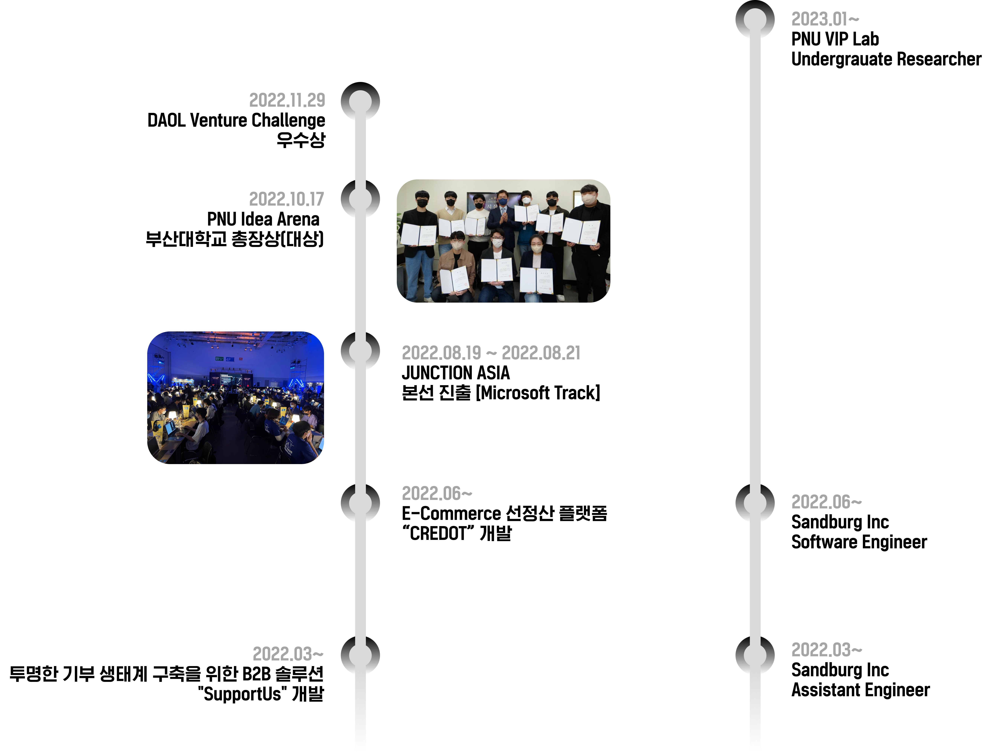

**Minseong-Kweon** is currently working as a Software-Engineer. He is attending [Pusan National University](https://www.pusan.ac.kr/kor/Main.do) and majoring in 'Mechanical Engineering' and double major in 'Industrial Artificial Intelligence'.

Minseong has been working as an early developer at a B2B startup called [Sandburg](https://www.sandburg.co.kr/) since he was a sophomore.  
Currently, I'm working as an undergraduate research student at the [VIP Lab](https://pnu-viplab.github.io/) of Pusan National University.

안녕하세요, 부산대학교 재학 중인 권민성입니다  
Vision 및 Multi Modal AI에 관심이 많습니다

